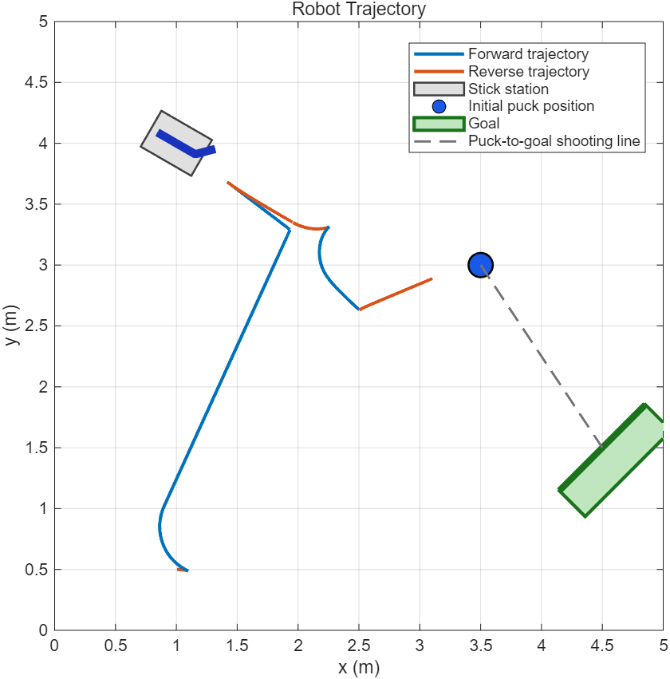
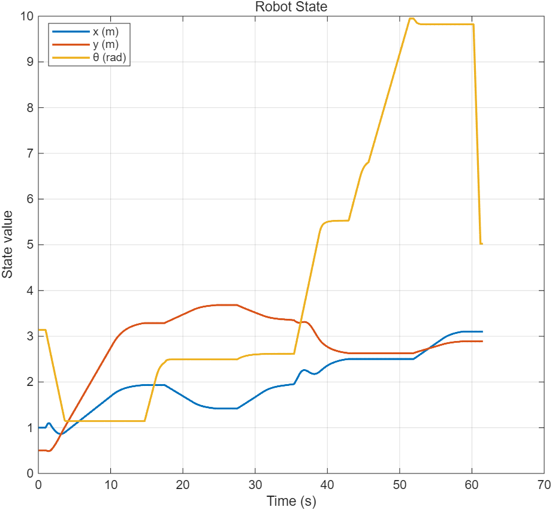
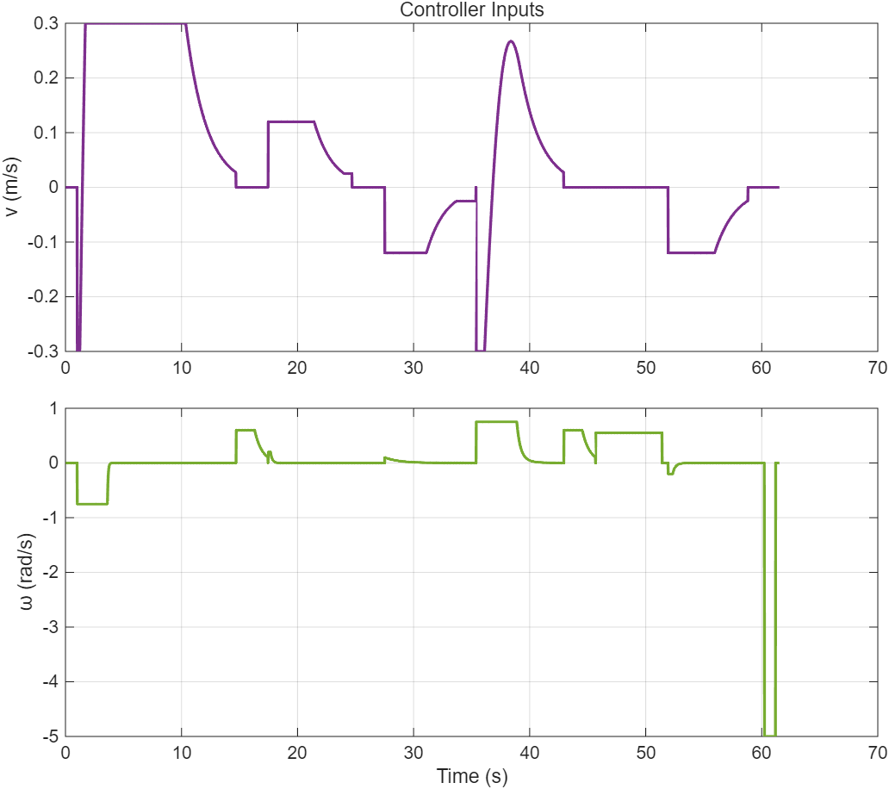

# RoboMaster Autonomous Hockey

Autonomous robotic hockey system developed for the **University of Waterloo ECE 486 — Control Systems** course project.

The project uses a **DJI RoboMaster EP mobile manipulator** to autonomously navigate to a hockey stick, grasp it, approach a puck, and shoot the puck toward a goal.

The system combines **approximate linearization control, ROS2, geometric planning, and finite-state control**, and was evaluated in simulation and on a physical RoboMaster EP.

---

## Project Overview

The objective of this project is to enable a RoboMaster EP to autonomously complete a robotic hockey task:

1. Navigate from the initial position to the hockey stick.
2. Align the robot with the stick.
3. Lower the robotic arm and grasp the stick using the gripper.
4. Lift the stick.
5. Navigate toward the puck while carrying the stick.
6. Position the robot for a shot.
7. Execute a shooting motion to send the puck toward the goal.

The complete task is coordinated through a **finite-state control architecture**.

---

## Control Method

The RoboMaster mobile base is modeled using unicycle kinematics.

- Position: $(x,y)$
- Heading angle: $\theta$
- Linear velocity: $v$
- Angular velocity: $\omega$

The navigation controller is based on **approximate linearization**.

Instead of directly controlling the center of the robot, a virtual point located a distance $\epsilon$ in front of the robot is defined as

$$
p =
\begin{bmatrix}
x + \epsilon \cos(\theta) \\
y + \epsilon \sin(\theta)
\end{bmatrix}.
$$

The controller computes the velocity required for this virtual point to track the desired trajectory and converts it into linear and angular velocity commands for the RoboMaster.

This allows trajectory tracking while respecting the nonholonomic motion constraints of the mobile platform.

---

## Autonomous Task Pipeline

```text
Start
  |
  v
Navigate to Hockey Stick
  |
  v
Align with Stick
  |
  v
Lower Arm
  |
  v
Close Gripper
  |
  v
Lift Stick
  |
  v
Navigate to Puck
  |
  v
Align for Shot
  |
  v
Execute Shooting Motion
  |
  v
Stop
```

Separate control logic is used for navigation, stick acquisition, and shooting.

---

## Simulation

The controller was developed and evaluated in simulation before deployment on the physical RoboMaster EP.

The repository includes both RoboMaster simulation and TurtleSim-based development and testing code.

### Robot Trajectory



### State Response



### Control Input



Additional simulation results:

- [Trajectory2.png](code/Trajectory2.png)
- [State2.png](code/State2.png)
- [Input2.png](code/Input2.png)
- [Model.png](code/Model.png)

---

## Physical Robot Experiment

The final controller was tested on a **DJI RoboMaster EP** equipped with a robotic arm and gripper.

Robot localization was provided by a **Vicon motion-capture system**. The measured robot pose was used by the controller to generate velocity commands in real time.

The physical experiment tested the complete autonomous sequence:

**Navigate → Grab Stick → Navigate → Approach Puck → Shoot**

The system was able to execute the complete task sequence autonomously without manual intervention.

---

## Technologies

- **Python**
- **ROS2**
- **MATLAB**
- **DJI RoboMaster EP**
- **Vicon Motion Capture**
- Approximate Linearization Control
- Finite-State Machine Control
- Robot Simulation

---

## Repository Structure

```text
robomaster-autonomous-hockey/
|
|-- README.md
|-- Project Report - Hanhua Ge.pdf
|
`-- code/
    |-- controller_final.py
    |-- controller.py
    |-- controller2.py
    |-- nevigate.py
    |-- shoot.py
    |-- shoot2.py
    |-- simulator.m
    |
    |-- simulator_tank/
    |   `-- multi_robomaster_ros_sim-main/
    |
    |-- simulator_turtle/
    |
    |-- Trajectory.png
    |-- Trajectory2.png
    |-- State.png
    |-- State2.png
    |-- Input.png
    |-- Input2.png
    `-- Model.png
```

---

## Main Controller

The primary controller implementation is:

[`code/controller_final.py`](code/controller_final.py)

Additional controller files represent intermediate development and testing versions.

---

## Project Report

Detailed information about the system modeling, controller design, autonomous task logic, simulation, and physical experiments can be found in the full project report:

**[View Project Report](Project%20Report%20-%20Hanhua%20Ge.pdf)**

---

## Author

**Hanhua Ge**

ECE 486 — Control Systems  
University of Waterloo